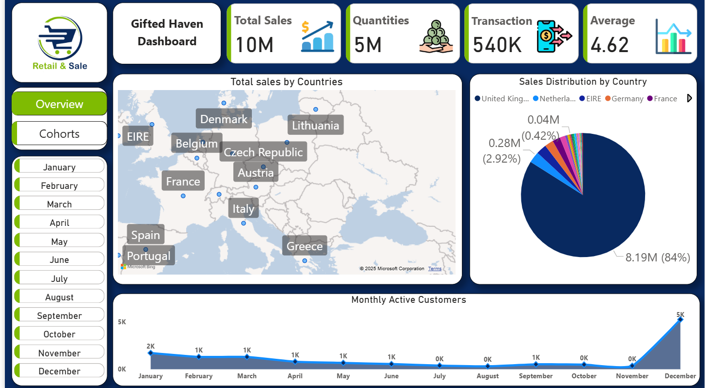
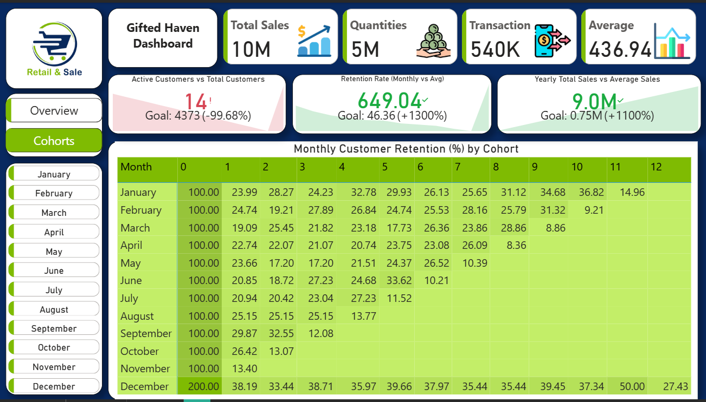

# Customer Churn Analysis Dashboard

## 📌 Project Overview
This project analyzes customer churn to identify patterns and provide insights for improving customer retention.  
The dashboard helps track key KPIs and trends to support data-driven decision-making.  

## 🎯 Objectives
- Understand customer churn trends over time  
- Track churn-related KPIs  
- Provide insights to reduce churn and improve retention  

## 🛠 Tools & Technologies
- **Power BI**: DAX formulas, Measures, KPIs, Interactive Dashboards, Data Modeling  
- **Power Query**: Data Cleaning and Transformation  
- **SQL (PostgreSQL)**: Data Extraction and Querying  

## 📊 Key Features
- Data extraction using PostgreSQL and transformation with Power Query  
- Built a Power BI dashboard with KPIs to monitor churn metrics  
- Designed interactive filters and slicers for dynamic analysis  
- Applied DAX formulas for advanced calculations  

## 🚀 Key Outcomes
- Identified churn trends and patterns across customer segments  
- Tracked KPIs to measure retention performance  
- Delivered an **interactive dashboard** for management decision-making  

## Dashboard Screenshot

